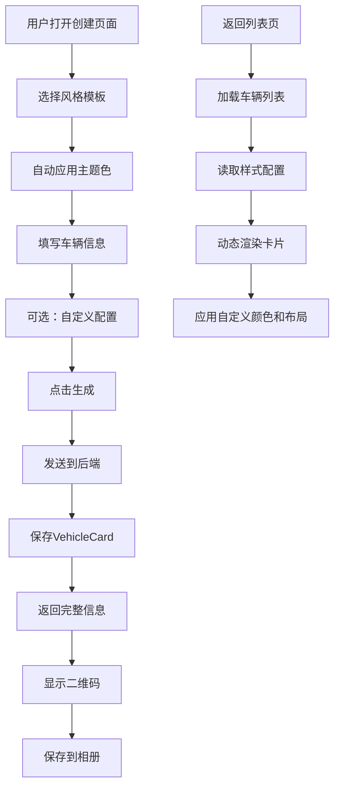

# 挪车贴图自定义功能 - 设计与实现说明

## 🎨 功能概述

现在每个车主可以：
1. **创建多个不同风格的挪车贴图**
2. **为不同的车辆/场景选择不同的设计**
3. **自定义颜色、布局、文本等元素**
4. **同一车主信息，多种视觉呈现**

---

## 📋 核心设计理念

### 数据模型

```
车主（Owner）
  └─ 挪车卡片列表（VehicleCard[]）
       ├─ 卡片1：现代简约风格 → 车牌A
       ├─ 卡片2：经典商务风格 → 车牌B  
       ├─ 卡片3：可爱卡通风格 → 车牌C
       └─ 卡片4：自定义风格 → 临时停车
```

### 关键特性

✅ **车主信息复用**：姓名、电话等基础信息可重复使用  
✅ **样式独立配置**：每张卡片可以有完全不同的视觉风格  
✅ **预设模板**：提供4种精心设计的风格模板  
✅ **自定义选项**：支持颜色、徽章、文本等个性化设置  

---

## 🎭 预设风格模板

### 1. 现代简约 (Modern) ✨
- **主题色**：紫色渐变 (#667eea → #764ba2)
- **背景色**：纯白 (#ffffff)
- **特点**：时尚、清新、适合年轻人
- **适用场景**：私家车、日常使用

### 2. 经典商务 (Classic) 💼
- **主题色**：深蓝渐变 (#1e3a8a → #1e40af)
- **背景色**：纯白 (#ffffff)
- **特点**：稳重、专业、商务范
- **适用场景**：商务车、公司用车

### 3. 可爱卡通 (Cute) 🎨
- **主题色**：粉色渐变 (#f472b6 → #ec4899)
- **背景色**：纯白 (#ffffff)
- **特点**：活泼、可爱、亲和力强
- **适用场景**：女性车主、个性车辆

### 4. 极简风格 (Minimal) ⚪
- **主题色**：灰色系 (#374151 → #6b7280)
- **背景色**：浅灰 (#f9fafb)
- **特点**：简洁、低调、极简主义
- **适用场景**：喜欢简约风格的用户

---

## 🔧 技术实现

### 后端改动

#### 1. VehicleCard 模型扩展

```java
public record VehicleCard(
    String id,
    String ownerId,
    String ownerName,
    String plateNo,
    String phone,
    String comfortMessage,
    // 新增字段
    String cardStyle,        // 卡片风格
    String backgroundColor,  // 背景颜色
    String themeColor,       // 主题颜色
    Boolean showPlateBadge,  // 是否显示车牌徽章
    String customText,       // 自定义文本
    Instant createdAt,
    Instant updatedAt
) {}
```

#### 2. DTO 更新

```java
// 请求DTO
public record UpsertVehicleRequest(
    @NotBlank String ownerName,
    String plateNo,
    @NotBlank @Pattern(...) String phone,
    String comfortMessage,
    // 新增样式配置
    String cardStyle,
    String backgroundColor,
    String themeColor,
    Boolean showPlateBadge,
    String customText
) {}

// 响应DTO
public record VehicleResponse(
    String id,
    String ownerName,
    String plateNo,
    String phone,
    String maskedPhone,
    String comfortMessage,
    String qrCodeUrl,
    String publicUrl,
    // 返回样式信息
    String cardStyle,
    String backgroundColor,
    String themeColor,
    Boolean showPlateBadge,
    String customText
) {}
```

#### 3. Service 层默认值处理

```java
public VehicleResponse create(Owner owner, UpsertVehicleRequest request) {
    VehicleCard vehicle = new VehicleCard(
        UUID.randomUUID().toString(),
        owner.id(),
        request.ownerName(),
        normalizeBlank(request.plateNo()),
        request.phone(),
        comfort(request.comfortMessage()),
        // 使用默认值或用户自定义
        defaultIfBlank(request.cardStyle(), "modern"),
        defaultIfBlank(request.backgroundColor(), "#ffffff"),
        defaultIfBlank(request.themeColor(), "#667eea"),
        request.showPlateBadge() == null ? true : request.showPlateBadge(),
        normalizeBlank(request.customText()),
        now, now
    );
    return toOwnerResponse(store.saveVehicle(vehicle));
}
```

---

### 前端改动

#### 1. 创建页面 - 样式选择器

**数据结构：**
```javascript
data: {
  cardStyle: "modern",
  backgroundColor: "#ffffff",
  themeColor: "#667eea",
  showPlateBadge: true,
  customText: "",
  styleTemplates: [
    { id: "modern", name: "现代简约", icon: "✨", colors: ["#667eea", "#764ba2"] },
    { id: "classic", name: "经典商务", icon: "💼", colors: ["#1e3a8a", "#1e40af"] },
    { id: "cute", name: "可爱卡通", icon: "🎨", colors: ["#f472b6", "#ec4899"] },
    { id: "minimal", name: "极简风格", icon: "⚪", colors: ["#374151", "#6b7280"] }
  ]
}
```

**UI组件：**
```xml
<!-- 样式选择区域 -->
<view class="style-section">
  <label>选择卡片风格</label>
  <view class="style-grid">
    <view wx:for="{{styleTemplates}}" wx:key="id" 
          class="style-card {{cardStyle === item.id ? 'selected' : ''}}"
          bindtap="selectStyle" 
          data-style="{{item.id}}">
      <view class="style-icon">{{item.icon}}</view>
      <view class="style-name">{{item.name}}</view>
      <view class="style-preview" 
            style="background: linear-gradient(135deg, {{item.colors[0]}} 0%, {{item.colors[1]}} 100%)">
      </view>
    </view>
  </view>
</view>

<!-- 自定义选项 -->
<view class="custom-options">
  <label>显示车牌徽章</label>
  <switch checked="{{showPlateBadge}}" bindchange="togglePlateBadge" />
  
  <label>自定义文本（可选）</label>
  <input value="{{customText}}" bindinput="onInput" 
         placeholder="例如：临时停车，请多包涵" />
</view>
```

**交互逻辑：**
```javascript
// 选择卡片样式
selectStyle(event) {
  const styleId = event.currentTarget.dataset.style;
  const template = this.data.styleTemplates.find(t => t.id === styleId);
  if (template) {
    this.setData({
      cardStyle: styleId,
      themeColor: template.colors[0],
      backgroundColor: styleId === 'minimal' ? '#f9fafb' : '#ffffff'
    });
  }
}

// 切换车牌徽章
togglePlateBadge(event) {
  this.setData({ showPlateBadge: event.detail.value });
}

// 提交时包含样式配置
createVehicle() {
  const requestData = {
    ...this.data.form,
    cardStyle: this.data.cardStyle,
    backgroundColor: this.data.backgroundColor,
    themeColor: this.data.themeColor,
    showPlateBadge: this.data.showPlateBadge,
    customText: this.data.customText
  };
  
  wx.request({
    url: `${this.data.apiBase}/api/vehicles`,
    method: "POST",
    data: requestData,
    // ...
  });
}
```

#### 2. 列表页面 - 动态样式展示

**动态应用样式：**
```xml
<view class="vehicle-card">
  <!-- 二维码区域 - 应用自定义背景 -->
  <view class="card-qrcode" 
        style="background: linear-gradient(135deg, {{item.backgroundColor}} 0%, {{item.themeColor}}20 100%)">
    <image src="{{apiBase}}/api/vehicles/{{item.id}}/qrcode"></image>
  </view>
  
  <!-- 车牌徽章 - 应用自定义主题色 -->
  <text class="plate-badge" 
        wx:if="{{item.showPlateBadge !== false}}"
        style="background: linear-gradient(135deg, {{item.themeColor}} 0%, {{item.themeColor}}dd 100%)">
    {{item.plateNo}}
  </text>
  
  <!-- 显示风格标签 -->
  <view class="info-row" wx:if="{{item.cardStyle}}">
    <text class="info-label">风格</text>
    <text class="info-value style-tag">{{getStyleName(item.cardStyle)}}</text>
  </view>
</view>
```

**风格名称映射：**
```javascript
getStyleName(styleId) {
  const styleMap = {
    'modern': '现代简约',
    'classic': '经典商务',
    'cute': '可爱卡通',
    'minimal': '极简风格'
  };
  return styleMap[styleId] || '自定义';
}
```

---

## 📱 用户使用流程

### 场景1：为不同车辆创建不同风格

```
步骤1：登录小程序
步骤2：点击"新建"
步骤3：填写信息
  - 车主：王先生
  - 车牌：京A88888
  - 电话：13800138000
  - 风格：选择"经典商务" 💼
步骤4：生成二维码 → 保存

步骤5：再次点击"新建"
步骤6：填写信息
  - 车主：王先生（相同）
  - 车牌：沪B66666
  - 电话：13800138000（相同）
  - 风格：选择"现代简约" ✨
步骤7：生成二维码 → 保存

结果：
- 同一个车主有2个不同风格的挪车码
- 京A88888 使用商务风格（深蓝色）
- 沪B66666 使用现代风格（紫色）
```

### 场景2：为同一车辆创建多个版本

```
用途：测试哪种风格效果更好

步骤1：创建"现代简约"版本 → 贴车窗左侧
步骤2：创建"可爱卡通"版本 → 贴车窗右侧
步骤3：观察哪个被扫码次数更多
步骤4：保留效果更好的版本
```

### 场景3：特殊场景定制

```
场景：临时停车

步骤1：点击"新建"
步骤2：填写信息
  - 车主：李女士
  - 车牌：（留空）
  - 电话：13900139000
  - 安慰语："临时停车5分钟，马上回来"
  - 风格：选择"极简风格"
  - 自定义文本："临时停车，请多包涵"
步骤3：生成 → 打印小尺寸 → 放在仪表盘
```

---

## 🎨 样式配置详解

### 可用配置项

| 配置项 | 类型 | 说明 | 示例值 |
|--------|------|------|--------|
| `cardStyle` | String | 卡片风格ID | "modern", "classic", "cute", "minimal" |
| `backgroundColor` | String | 背景颜色（十六进制） | "#ffffff", "#f9fafb" |
| `themeColor` | String | 主题颜色（十六进制） | "#667eea", "#1e3a8a" |
| `showPlateBadge` | Boolean | 是否显示车牌徽章 | true / false |
| `customText` | String | 自定义文本 | "临时停车，请多包涵" |

### 默认值策略

```java
// 如果用户未指定，使用以下默认值
cardStyle: "modern"           // 现代简约
backgroundColor: "#ffffff"    // 纯白背景
themeColor: "#667eea"         // 紫色主题
showPlateBadge: true          // 显示车牌徽章
customText: null              // 无自定义文本
```

---

## 🖼️ UI 设计细节

### 样式选择器

**布局：**
- 2x2 网格布局
- 每个卡片包含：图标 + 名称 + 颜色预览条
- 选中状态：紫色边框 + 渐变背景 + 阴影

**交互：**
- 点击切换选中状态
- 按下时有缩放动画（scale 0.95）
- 自动应用对应的主题色

**视觉效果：**
```css
.style-card.selected {
  background: linear-gradient(135deg, rgba(102, 126, 234, 0.1), rgba(118, 75, 162, 0.1));
  border-color: #667eea;
  box-shadow: 0 4rpx 12rpx rgba(102, 126, 234, 0.2);
}
```

### 列表卡片动态样式

**二维码区域背景：**
```css
/* 根据卡片的 backgroundColor 和 themeColor 动态生成 */
background: linear-gradient(135deg, 
  {{item.backgroundColor}} 0%, 
  {{item.themeColor}}20 100%);
```

**车牌徽章颜色：**
```css
/* 根据 themeColor 动态生成渐变 */
background: linear-gradient(135deg, 
  {{item.themeColor}} 0%, 
  {{item.themeColor}}dd 100%);
```

**风格标签：**
- 紫色渐变背景（固定）
- 圆角小标签
- 显示在卡片底部

---

## 📊 数据流图



---

## 🎯 核心优势

### 1. 个性化表达
- ✅ 车主可以根据自己的喜好选择风格
- ✅ 不同车辆可以使用不同风格
- ✅ 体现个人品味和个性

### 2. 场景适配
- ✅ 商务车用商务风格
- ✅ 私家车用时尚风格
- ✅ 临时停车用简约风格

### 3. A/B 测试
- ✅ 可以为同一车辆创建多个版本
- ✅ 测试哪种风格更有效
- ✅ 数据驱动优化

### 4. 灵活性
- ✅ 预设模板快速上手
- ✅ 自定义选项满足特殊需求
- ✅ 可扩展更多风格

---

## 🚀 未来扩展方向

### 短期优化
1. **更多预设模板**
   - 运动风格（红色/橙色）
   - 自然风格（绿色/棕色）
   - 科技风格（蓝色/青色）

2. **高级自定义**
   - 上传自定义背景图片
   - 调整字体大小
   - 选择字体样式

3. **批量操作**
   - 一键复制卡片并修改风格
   - 批量导出所有二维码

### 长期规划
1. **AI 推荐**
   - 根据车型推荐合适风格
   - 根据用户画像推荐配色

2. **社区分享**
   - 用户可以分享自己的设计
   - 热门风格排行榜
   - 设计师作品市场

3. **数据分析**
   - 统计各风格的扫码率
   - 分析哪种风格最有效
   - 提供优化建议

---

## 📝 API 接口说明

### 创建车辆卡片

**请求：**
```http
POST /api/vehicles
Authorization: Bearer {token}
Content-Type: application/json

{
  "ownerName": "王先生",
  "plateNo": "京A88888",
  "phone": "13800138000",
  "comfortMessage": "您好，麻烦您了",
  "cardStyle": "modern",
  "backgroundColor": "#ffffff",
  "themeColor": "#667eea",
  "showPlateBadge": true,
  "customText": ""
}
```

**响应：**
```json
{
  "id": "uuid-xxx",
  "ownerName": "王先生",
  "plateNo": "京A88888",
  "phone": "13800138000",
  "maskedPhone": "138****8000",
  "comfortMessage": "您好，麻烦您了",
  "qrCodeUrl": "/api/vehicles/uuid-xxx/qrcode",
  "publicUrl": "https://...",
  "cardStyle": "modern",
  "backgroundColor": "#ffffff",
  "themeColor": "#667eea",
  "showPlateBadge": true,
  "customText": ""
}
```

### 查询车辆列表

**响应中包含样式信息：**
```json
[
  {
    "id": "uuid-1",
    "ownerName": "王先生",
    "plateNo": "京A88888",
    "cardStyle": "modern",
    "themeColor": "#667eea",
    "backgroundColor": "#ffffff",
    "showPlateBadge": true,
    ...
  },
  {
    "id": "uuid-2",
    "ownerName": "王先生",
    "plateNo": "沪B66666",
    "cardStyle": "classic",
    "themeColor": "#1e3a8a",
    "backgroundColor": "#ffffff",
    "showPlateBadge": true,
    ...
  }
]
```

---

## ✅ 测试清单

### 功能测试
- [ ] 可以选择不同的风格模板
- [ ] 选择模板后自动应用主题色
- [ ] 可以切换车牌徽章显示
- [ ] 可以输入自定义文本
- [ ] 提交后样式配置正确保存
- [ ] 列表页正确显示样式信息
- [ ] 卡片背景色动态应用
- [ ] 车牌徽章颜色动态应用
- [ ] 风格标签正确显示

### UI 测试
- [ ] 样式选择器美观易用
- [ ] 选中状态清晰可见
- [ ] 颜色预览条准确显示
- [ ] 动画流畅自然
- [ ] 响应式布局正常

### 兼容性测试
- [ ] 旧数据兼容（无样式字段）
- [ ] 默认值正确应用
- [ ] 各种颜色值正确处理

---

## 🎊 总结

通过这次升级，安心挪车码小程序实现了：

1. ✅ **个性化定制**：车主可以根据喜好选择风格
2. ✅ **多样化呈现**：同一车主可以有多个不同风格的挪车码
3. ✅ **灵活配置**：预设模板 + 自定义选项
4. ✅ **优秀体验**：直观的样式选择器，实时预览效果
5. ✅ **可扩展性**：易于添加新风格和配置项

**现在的系统不仅是一个工具，更是一个个性化表达的平台！** 🎨✨
