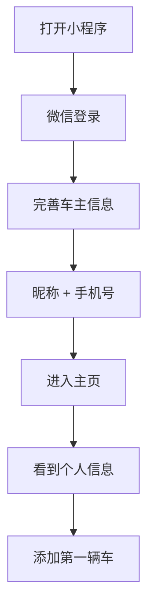
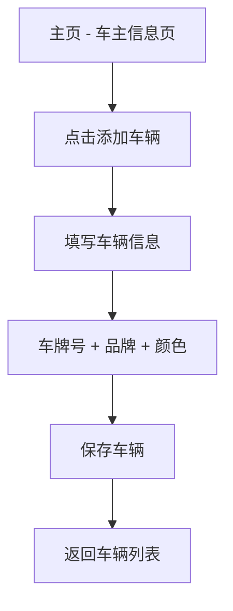
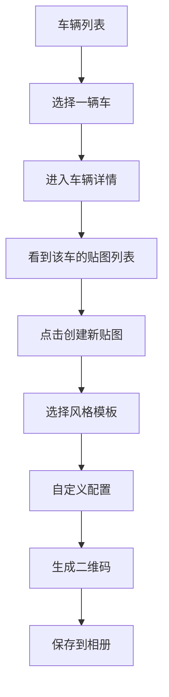

# 安心挪车码 - 新架构设计文档

## 🎯 核心业务逻辑重构

### 问题分析

**之前的设计问题：**
- ❌ 车主信息和车辆信息混在一起
- ❌ 每次创建都要重复填写车主信息
- ❌ 无法为同一辆车创建多个不同风格的贴图

**新的设计方案：**
- ✅ 车主档案独立（昵称、手机号）
- ✅ 车辆管理独立（可以添加多辆车）
- ✅ 挪车贴图独立（可以为每辆车创建多个贴图）

---

## 📊 数据模型设计

### 三层架构

```
┌─────────────────────────────────────────┐
│ 1. Owner (车主档案)                      │
│    - id                                  │
│    - nickname (昵称)                     │
│    - phone (手机号)                      │
└────────────┬────────────────────────────┘
             │ 1:N
             ▼
┌─────────────────────────────────────────┐
│ 2. Vehicle (车辆档案)                    │
│    - id                                  │
│    - ownerId (所属车主)                  │
│    - plateNo (车牌号)                    │
│    - brand (品牌，可选)                   │
│    - color (颜色，可选)                   │
└────────────┬────────────────────────────┘
             │ 1:N
             ▼
┌─────────────────────────────────────────┐
│ 3. VehicleCard (挪车贴图卡片)            │
│    - id                                  │
│    - ownerId (车主ID)                    │
│    - vehicleId (关联车辆)                │
│    - cardStyle (风格)                    │
│    - backgroundColor (背景色)            │
│    - themeColor (主题色)                 │
│    - showPlateBadge (显示车牌徽章)       │
│    - customMessage (自定义问候语)        │
│    - customText (自定义文本)             │
└─────────────────────────────────────────┘
```

### 关系说明

- **1个车主** → **N辆车**
- **1辆车** → **N个挪车贴图**
- **1个挪车贴图** → **1个二维码**

---

## 🔄 用户操作流程

### 流程1：首次使用



### 流程2：添加车辆



### 流程3：创建挪车贴图



---

## 📱 页面结构设计

### 页面1：车主主页（Owner Profile）

**路径：** `/pages/owner/index`

**内容：**
```
┌─────────────────────────┐
│   👤 车主信息           │
│   ┌─────────────────┐  │
│   │ 昵称：王先生     │  │
│   │ 手机：138****8000│  │
│   │ 车辆：3辆        │  │
│   │ 贴图：8个        │  │
│   └─────────────────┘  │
│                         │
│   [编辑个人信息]        │
│                         │
│   ┌─────────────────┐  │
│   │ 🚗 我的车辆     │  │
│   └─────────────────┘  │
│                         │
│   [+ 添加新车]          │
└─────────────────────────┘
```

---

### 页面2：车辆列表（Vehicle List）

**路径：** `/pages/vehicles/index`

**内容：**
```
┌─────────────────────────┐
│   🚗 我的车辆 (3)       │
│                         │
│   ┌─────────────────┐  │
│   │ 京A88888        │  │
│   │ 奔驰 E300       │  │
│   │ 黑色            │  │
│   │ 贴图: 3个 >     │  │
│   └─────────────────┘  │
│                         │
│   ┌─────────────────┐  │
│   │ 沪B66666        │  │
│   │ 宝马 3系        │  │
│   │ 白色            │  │
│   │ 贴图: 2个 >     │  │
│   └─────────────────┘  │
│                         │
│   ┌─────────────────┐  │
│   │ 京C99999        │  │
│   │ Mini Cooper     │  │
│   │ 粉色            │  │
│   │ 贴图: 3个 >     │  │
│   └─────────────────┘  │
│                         │
│   [+ 添加新车]          │
└─────────────────────────┘
```

---

### 页面3：车辆详情 / 贴图列表（Vehicle Detail）

**路径：** `/pages/vehicle-detail/index?id={vehicleId}`

**内容：**
```
┌─────────────────────────┐
│   ← 京A88888            │
│   奔驰 E300 | 黑色      │
│                         │
│   📱 挪车贴图 (3)       │
│                         │
│   ┌─────────────────┐  │
│   │ QR [紫色背景]   │  │
│   │ 现代简约 ✨     │  │
│   │ [预览] [删除]   │  │
│   └─────────────────┘  │
│                         │
│   ┌─────────────────┐  │
│   │ QR [蓝色背景]   │  │
│   │ 经典商务 💼     │  │
│   │ [预览] [删除]   │  │
│   └─────────────────┘  │
│                         │
│   ┌─────────────────┐  │
│   │ QR [粉色背景]   │  │
│   │ 可爱卡通 🎨     │  │
│   │ [预览] [删除]   │  │
│   └─────────────────┘  │
│                         │
│   [+ 创建新贴图]        │
└─────────────────────────┘
```

---

### 页面4：创建贴图（Create Card）

**路径：** `/pages/create-card/index?vehicleId={vehicleId}`

**内容：**
```
┌─────────────────────────┐
│   ← 为京A88888创建贴图  │
│                         │
│   选择风格              │
│   ┌──────┬──────┐      │
│   │ ✨   │ 💼   │      │
│   │现代  │商务  │      │
│   ├──────┼──────┤      │
│   │ 🎨   │ ⚪   │      │
│   │可爱  │极简  │      │
│   └──────┴──────┘      │
│                         │
│   自定义配置            │
│   问候语：[________]    │
│   自定义文本：[____]    │
│   显示车牌徽章：[ON]    │
│                         │
│   [生成二维码]          │
└─────────────────────────┘
```

---

## 🔧 API 接口设计

### 1. 认证相关

#### 登录
```http
POST /api/auth/wechat-login
Content-Type: application/json

{
  "code": "wechat_login_code",
  "nickname": "王先生"
}

Response:
{
  "token": "jwt_token",
  "owner": {
    "id": "owner-123",
    "nickname": "王先生",
    "phone": "13800138000",
    "vehicleCount": 3,
    "cardCount": 8
  }
}
```

#### 更新车主信息
```http
PUT /api/owner/profile
Authorization: Bearer {token}
Content-Type: application/json

{
  "nickname": "王先生",
  "phone": "13800138000"
}
```

---

### 2. 车辆管理

#### 创建车辆
```http
POST /api/vehicles
Authorization: Bearer {token}
Content-Type: application/json

{
  "plateNo": "京A88888",
  "brand": "奔驰",
  "color": "黑色"
}

Response:
{
  "id": "vehicle-xxx",
  "plateNo": "京A88888",
  "brand": "奔驰",
  "color": "黑色",
  "cardCount": 0,
  "createdAt": "2026-06-10T10:00:00Z"
}
```

#### 查询车辆列表
```http
GET /api/vehicles
Authorization: Bearer {token}

Response:
[
  {
    "id": "vehicle-1",
    "plateNo": "京A88888",
    "brand": "奔驰",
    "color": "黑色",
    "cardCount": 3,
    "createdAt": "..."
  },
  {
    "id": "vehicle-2",
    "plateNo": "沪B66666",
    "brand": "宝马",
    "color": "白色",
    "cardCount": 2,
    "createdAt": "..."
  }
]
```

#### 删除车辆
```http
DELETE /api/vehicles/{id}
Authorization: Bearer {token}
```

---

### 3. 挪车卡片管理

#### 创建卡片
```http
POST /api/cards
Authorization: Bearer {token}
Content-Type: application/json

{
  "vehicleId": "vehicle-xxx",
  "cardStyle": "modern",
  "backgroundColor": "#ffffff",
  "themeColor": "#667eea",
  "showPlateBadge": true,
  "customMessage": "您好，给您添麻烦了",
  "customText": ""
}

Response:
{
  "id": "card-xxx",
  "vehicleId": "vehicle-xxx",
  "plateNo": "京A88888",
  "cardStyle": "modern",
  "backgroundColor": "#ffffff",
  "themeColor": "#667eea",
  "showPlateBadge": true,
  "customMessage": "您好，给您添麻烦了",
  "customText": "",
  "qrCodeUrl": "/api/cards/card-xxx/qrcode",
  "publicUrl": "https://...",
  "createdAt": "..."
}
```

#### 查询车辆的卡片列表
```http
GET /api/vehicles/{vehicleId}/cards
Authorization: Bearer {token}

Response:
[
  {
    "id": "card-1",
    "plateNo": "京A88888",
    "cardStyle": "modern",
    "themeColor": "#667eea",
    ...
  },
  {
    "id": "card-2",
    "plateNo": "京A88888",
    "cardStyle": "classic",
    "themeColor": "#1e3a8a",
    ...
  }
]
```

#### 删除卡片
```http
DELETE /api/cards/{id}
Authorization: Bearer {token}
```

---

### 4. 公开接口（扫码者访问）

#### 获取卡片公开信息
```http
GET /api/public/cards/{cardId}

Response:
{
  "cardId": "card-xxx",
  "plateNo": "京A88888",
  "ownerName": "王先生",
  "maskedPhone": "138****8000",
  "phone": "13800138000",
  "customMessage": "您好，给您添麻烦了",
  "customText": "",
  "themeColor": "#667eea"
}
```

#### 获取二维码图片
```http
GET /api/cards/{cardId}/qrcode
Accept: image/png

Response: PNG image
```

---

## 📂 文件结构

### 后端（Java Spring Boot）

```
src/main/java/com/example/carphone/
├── model/
│   ├── Owner.java              # 车主档案
│   ├── Vehicle.java            # 车辆档案（新增）
│   └── VehicleCard.java        # 挪车卡片（重构）
├── dto/
│   └── AppDtos.java            # 所有DTO（新建）
├── repository/
│   └── InMemoryStore.java      # 数据存储（重构）
├── service/
│   ├── AuthService.java        # 认证服务
│   ├── OwnerService.java       # 车主服务（新增）
│   ├── VehicleService.java     # 车辆服务（重构）
│   ├── CardService.java        # 卡片服务（新增）
│   └── QrCodeService.java      # 二维码服务
└── controller/
    ├── AuthController.java     # 认证控制器
    ├── OwnerController.java    # 车主控制器（新增）
    ├── VehicleController.java  # 车辆控制器（重构）
    ├── CardController.java     # 卡片控制器（新增）
    └── PublicController.java   # 公开接口控制器（新增）
```

### 前端（微信小程序）

```
miniprogram/pages/
├── owner/                      # 车主主页（新增）
│   ├── index.js
│   ├── index.wxml
│   ├── index.wxss
│   └── index.json
├── vehicles/                   # 车辆列表（新增）
│   ├── index.js
│   ├── index.wxml
│   ├── index.wxss
│   └── index.json
├── vehicle-detail/             # 车辆详情/卡片列表（新增）
│   ├── index.js
│   ├── index.wxml
│   ├── index.wxss
│   └── index.json
├── create-card/                # 创建卡片（重构原create）
│   ├── index.js
│   ├── index.wxml
│   ├── index.wxss
│   └── index.json
└── call/                       # 呼叫页面（保持不变）
    ├── index.js
    ├── index.wxml
    ├── index.wxss
    └── index.json
```

---

## 🎯 核心优势

### 1. 清晰的职责分离
- Owner：只管理车主基本信息
- Vehicle：只管理车辆信息
- VehicleCard：只管理挪车贴图样式

### 2. 灵活的多对多关系
- 一个车主可以有多个车辆
- 一个车辆可以有多个贴图
- 每个贴图可以有不同的风格

### 3. 更好的用户体验
- 不需要重复填写车主信息
- 可以为喜欢的车创建多个版本
- 方便管理和组织

### 4. 易于扩展
- 可以轻松添加更多车辆属性
- 可以添加更多卡片样式配置
- 可以添加统计分析功能

---

## 🚀 实施计划

### Phase 1: 后端重构（已完成50%）
- ✅ 创建新的数据模型（Owner, Vehicle, VehicleCard）
- ✅ 更新Repository层
- ✅ 创建新的DTO
- ⏳ 创建Service层
- ⏳ 创建Controller层

### Phase 2: 前端重构（待开始）
- ⏳ 创建车主主页页面
- ⏳ 创建车辆列表页面
- ⏳ 创建车辆详情页面
- ⏳ 重构创建卡片页面
- ⏳ 更新TabBar配置

### Phase 3: 测试与优化
- ⏳ 功能测试
- ⏳ UI/UX优化
- ⏳ 性能优化

---

## 📝 下一步行动

1. **完成Service层实现**
   - OwnerService
   - VehicleService  
   - CardService

2. **完成Controller层实现**
   - OwnerController
   - VehicleController
   - CardController
   - PublicController

3. **创建前端页面**
   - 车主主页
   - 车辆列表
   - 车辆详情
   - 创建卡片

4. **联调测试**
   - 前后端接口对接
   - 完整流程测试

---

这个新架构更加清晰、灵活，完全符合您的需求！接下来我会逐步实现各个组件。
